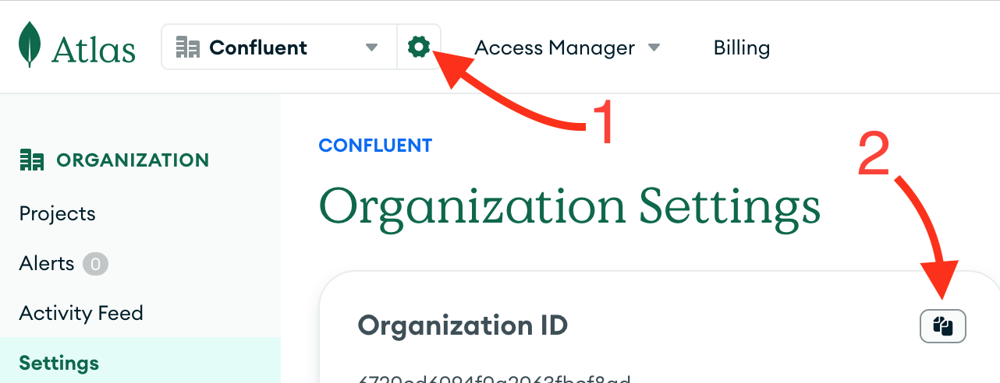

# System Requirements

- [Requirements](#requirements)
  - [System Requirements](#system-requirements)
  - [Python Dependencies](#python-dependencies)
  - [Access Keys to Cloud Services Providers](#access-keys-to-cloud-services-providers)
    - [MongoDB Atlas](#mongodb-atlas)

## Requirements

### System Requirements
* **Python 3.13+** (latest version recommended)
* **MongoDB** (local installation or MongoDB Atlas)
* **Node.js 16+** (for frontend interface)
* **Docker** (optional, for containerized deployment)

### Python Dependencies

The module uses several key Python libraries:

* `scikit-learn` - Machine learning models (Logistic Regression, Random Forest)
* `sentence-transformers` - Open-source embeddings for semantic search
* `litellm` - Multi-provider LLM integration
* `pymongo` - MongoDB driver for data storage
* `fastapi` - REST API framework
* `pandas` - Data processing and analysis

### Access Keys to Cloud Services Providers

Once you have `docker` installed, you just need to get keys to authenticate to the various CSPs.

#### MongoDB Atlas

1. Connect to the Atlas UI. You must have Organisation Owner access to Atlas.
2. Select *Organisation Access* from the *Access Manager* menu in the navigation bar.
3. Click *Access Manager* in the sidebar. (The Organisation Access Manager page displays.)
4. Click *Add new* then *API Key*
5. In the *API Key Information*, enter a description.
6. In the *Organisation Permissions* menu, select the *Organisation Owner* role. **Important:** Make sure that only the
   *Organisation Owner* role is selected, you may have to click the default *Organisation Member* to un-select it.
7. Click *Next*, copy the public and private key in a safe place and click *Done*.

Useful links:

* [Grant Programmatic Access to an Organisation](https://www.mongodb.com/docs/atlas/configure-api-access/#grant-programmatic-access-to-an-organization)
* [MongoDB Atlas API Keys](https://www.mongodb.com/developer/products/atlas/mongodb-atlas-with-terraform/) (part of a
  tutorial on Terraform with Atlas)

At last, get your Atlas Organisation ID from the Atlas UI.

